<h1 align="center" style="border-bottom: none">
    GCP Apigee Universal Orchestrator Extension
</h1>

<p align="center">
  <!-- Badges -->

<a href="https://github.com/Keyfactor/gcp-apigee-orchestrator/releases"></a>


</p>

<p align="center">
  <!-- TOC -->
  <a href="#support">
    <b>Support</b>
  </a>
  ·
  <a href="#installation">
    <b>Installation</b>
  </a>
  ·
  <a href="#license">
    <b>License</b>
  </a>
  ·
  <a href="https://github.com/orgs/Keyfactor/repositories?q=orchestrator">
    <b>Related Integrations</b>
  </a>
</p>

## Overview

Apigee is a Google Cloud Platform (GCP) software product for developing and managing APIs. The remote GCP Apigee Orchestrator allows for the remote management of Apigee certificate stores. Inventory and Management functions are supported. The Orchestrator performs operations utilizing the Apigee REST API.


## Compatibility

This integration is compatible with Keyfactor Universal Orchestrator version 10.4 and later.

## Support
The GCP Apigee Universal Orchestrator extension If you have a support issue, please open a support ticket by either contacting your Keyfactor representative or via the Keyfactor Support Portal at https://support.keyfactor.com. 
 
> To report a problem or suggest a new feature, use the **[Issues](../../issues)** tab. If you want to contribute actual bug fixes or proposed enhancements, use the **[Pull requests](../../pulls)** tab.

## Requirements & Prerequisites

Before installing the GCP Apigee Universal Orchestrator extension, we recommend that you install [kfutil](https://github.com/Keyfactor/kfutil). Kfutil is a command-line tool that simplifies the process of creating store types, installing extensions, and instantiating certificate stores in Keyfactor Command.


**Google Cloud Configuration**

1. Read up on Google Cloud Provider Apigee and how it works. 

	*User must create a service account through the Google Cloud Console that will be used to generate an OAuth 2.0 token when making Apigee API requests 

		*Within the Google Cloud Console (console.cloud.google.com), select the project for which you will generate the OAuth 2.0 token
		
		*Click on the menu at the top-left and navigate to "APIs & Services"
		
		*Select "Credentials" from the sub-menu
		
		*Create a new Service Account by clicking the "Create Credentials" at the top of the screen and complete the following relevant to your environment:
			*Service Account Details
				*Service account name = Keyfactor-ApigeeAPI
					*This can be something to uniquely identify what this service account will be used for
				*Service account ID
				*Service account description
			*Grant this service account access to project
				*Select role: Quick Access > Basic > Owner
		*Click the "Done" button
		
	*Create service account key 

		*From the "APIs & Services" page, select the service account you just created in the previous step

		*Go to the "Keys" tab located across the top of the page 

		*Click the "Add Key" button in the middle of the page and select the "Create new key" option 

		*Make sure the key type selected is a JSON
			*(This is the key you will provide when configuring the cert store as outlined in the following instructions)
			
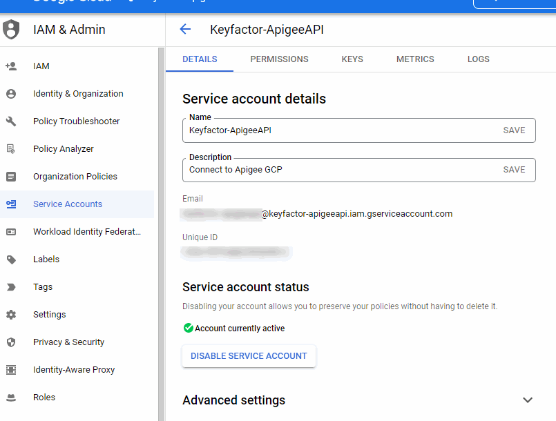
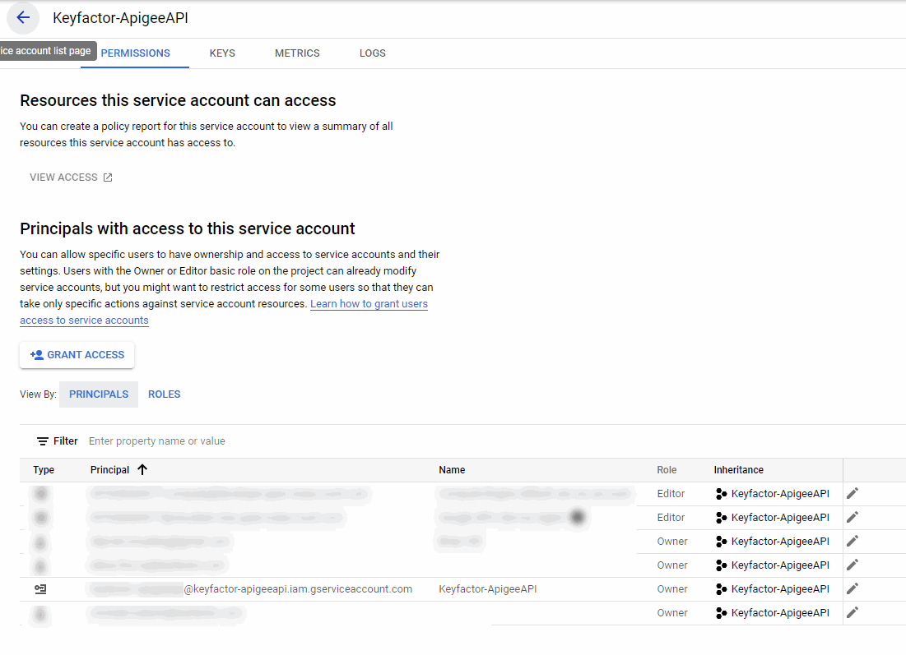
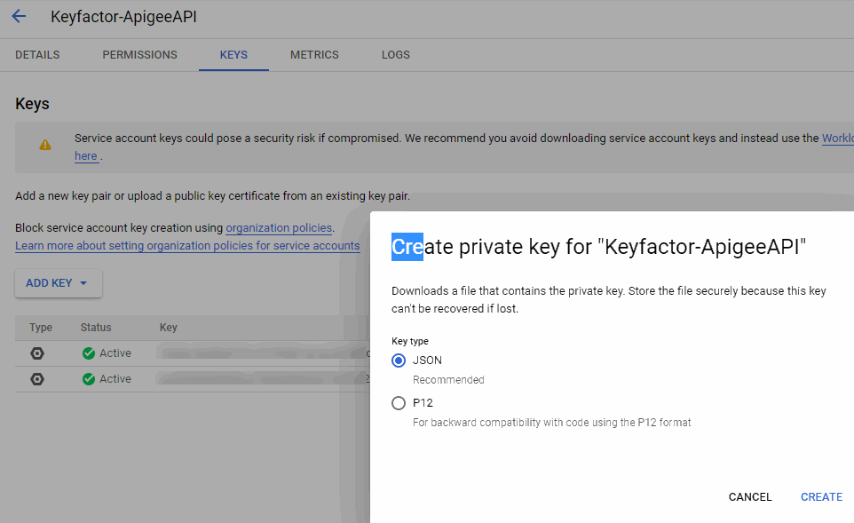


## Create the GcpApigee Certificate Store Type

To use the GCP Apigee Universal Orchestrator extension, you **must** create the GcpApigee Certificate Store Type. This only needs to happen _once_ per Keyfactor Command instance.


### Using kfutil:

#### Using online definition from GitHub:
This will reach out to GitHub and pull the latest store-type definition
```shell
# Google Cloud Provider Apigee
kfutil store-types create GcpApigee
```

#### Offline creation using integration-manifest file:
If required, it is possible to create store types from the [integration-manifest.json](./integration-manifest.json) included in this repo.
```shell
kfutil store-types create --from-file integration-manifest.json
```

### Manually
* **Create GcpApigee manually in the Command UI**:
    <details><summary>Create GcpApigee manually in the Command UI</summary>

    Create a store type called `GcpApigee` with the attributes in the tables below:

    #### Basic Tab
    | Attribute | Value | Description |
    | --------- | ----- | ----- |
    | Name | Google Cloud Provider Apigee | Display name for the store type (may be customized) |
    | Short Name | GcpApigee | Short display name for the store type |
    | Capability | GcpApigee | Store type name orchestrator will register with. Check the box to allow entry of value |
    | Supports Add | ✅ Checked | Check the box. Indicates that the Store Type supports Management Add |
    | Supports Remove | ✅ Checked | Check the box. Indicates that the Store Type supports Management Remove |
    | Supports Discovery | 🔲 Unchecked |  Indicates that the Store Type supports Discovery |
    | Supports Reenrollment | 🔲 Unchecked |  Indicates that the Store Type supports Reenrollment |
    | Supports Create | ✅ Checked | Check the box. Indicates that the Store Type supports store creation |
    | Needs Server | 🔲 Unchecked | Determines if a target server name is required when creating store |
    | Blueprint Allowed | 🔲 Unchecked | Determines if store type may be included in an Orchestrator blueprint |
    | Uses PowerShell | 🔲 Unchecked | Determines if underlying implementation is PowerShell |
    | Requires Store Password | 🔲 Unchecked | Enables users to optionally specify a store password when defining a Certificate Store. |
    | Supports Entry Password | 🔲 Unchecked | Determines if an individual entry within a store can have a password. |

    The Basic tab should look like this:

    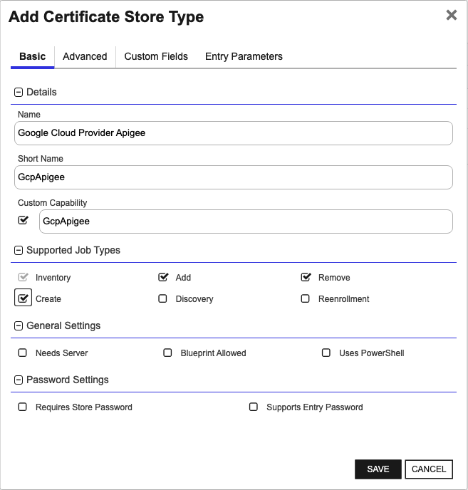

    #### Advanced Tab
    | Attribute | Value | Description |
    | --------- | ----- | ----- |
    | Supports Custom Alias | Required | Determines if an individual entry within a store can have a custom Alias. |
    | Private Key Handling | Optional | This determines if Keyfactor can send the private key associated with a certificate to the store. Required because IIS certificates without private keys would be invalid. |
    | PFX Password Style | Default | 'Default' - PFX password is randomly generated, 'Custom' - PFX password may be specified when the enrollment job is created (Requires the Allow Custom Password application setting to be enabled.) |

    The Advanced tab should look like this:

    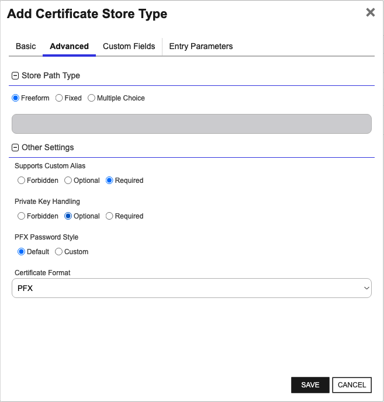

    > For Keyfactor **Command versions 24.4 and later**, a Certificate Format dropdown is available with PFX and PEM options. Ensure that **PFX** is selected, as this determines the format of new and renewed certificates sent to the Orchestrator during a Management job. Currently, all Keyfactor-supported Orchestrator extensions support only PFX.

    #### Custom Fields Tab
    Custom fields operate at the certificate store level and are used to control how the orchestrator connects to the remote target server containing the certificate store to be managed. The following custom fields should be added to the store type:

    | Name | Display Name | Description | Type | Default Value/Options | Required |
    | ---- | ------------ | ---- | --------------------- | -------- | ----------- |
    | isTrustStore | Is Trust Store? | Should be checked if the Apigee keystore being managed is a truststore. | Bool | false | ✅ Checked |
    | jsonKey | Google Json Key File | The JSON key tied to the Apigee service account. You can copy and paste the entire Json key in the textbox when creating a certificate store in the Keyfactor Command UI. | Secret |  | ✅ Checked |

    The Custom Fields tab should look like this:

    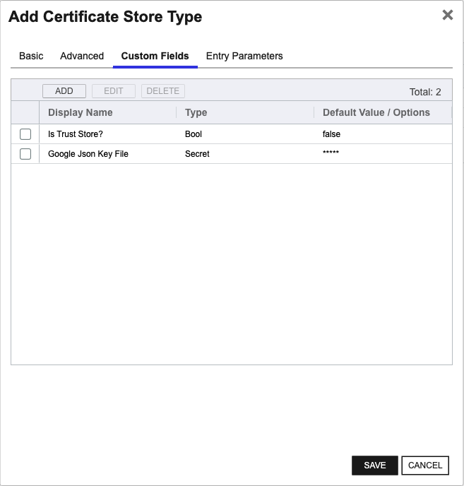


## Installation

1. **Download the latest GCP Apigee Universal Orchestrator extension from GitHub.** 

    Navigate to the [GCP Apigee Universal Orchestrator extension GitHub version page](https://github.com/Keyfactor/gcp-apigee-orchestrator/releases/latest). Refer to the compatibility matrix below to determine whether the `net6.0` or `net8.0` asset should be downloaded. Then, click the corresponding asset to download the zip archive.

    | Universal Orchestrator Version | Latest .NET version installed on the Universal Orchestrator server | `rollForward` condition in `Orchestrator.runtimeconfig.json` | `gcp-apigee-orchestrator` .NET version to download |
    | --------- | ----------- | ----------- | ----------- |
    | Older than `11.0.0` | | | `net6.0` |
    | Between `11.0.0` and `11.5.1` (inclusive) | `net6.0` | | `net6.0` | 
    | Between `11.0.0` and `11.5.1` (inclusive) | `net8.0` | `Disable` | `net6.0` | 
    | Between `11.0.0` and `11.5.1` (inclusive) | `net8.0` | `LatestMajor` | `net8.0` | 
    | `11.6` _and_ newer | `net8.0` | | `net8.0` |

    Unzip the archive containing extension assemblies to a known location.

    > **Note** If you don't see an asset with a corresponding .NET version, you should always assume that it was compiled for `net6.0`.

2. **Locate the Universal Orchestrator extensions directory.**

    * **Default on Windows** - `C:\Program Files\Keyfactor\Keyfactor Orchestrator\extensions`
    * **Default on Linux** - `/opt/keyfactor/orchestrator/extensions`
    
3. **Create a new directory for the GCP Apigee Universal Orchestrator extension inside the extensions directory.**
        
    Create a new directory called `gcp-apigee-orchestrator`.
    > The directory name does not need to match any names used elsewhere; it just has to be unique within the extensions directory.

4. **Copy the contents of the downloaded and unzipped assemblies from __step 2__ to the `gcp-apigee-orchestrator` directory.**

5. **Restart the Universal Orchestrator service.**

    Refer to [Starting/Restarting the Universal Orchestrator service](https://software.keyfactor.com/Core-OnPrem/Current/Content/InstallingAgents/NetCoreOrchestrator/StarttheService.htm).


6. **(optional) PAM Integration** 

    The GCP Apigee Universal Orchestrator extension is compatible with all supported Keyfactor PAM extensions to resolve PAM-eligible secrets. PAM extensions running on Universal Orchestrators enable secure retrieval of secrets from a connected PAM provider.

    To configure a PAM provider, [reference the Keyfactor Integration Catalog](https://keyfactor.github.io/integrations-catalog/content/pam) to select an extension, and follow the associated instructions to install it on the Universal Orchestrator (remote).


> The above installation steps can be supplemented by the [official Command documentation](https://software.keyfactor.com/Core-OnPrem/Current/Content/InstallingAgents/NetCoreOrchestrator/CustomExtensions.htm?Highlight=extensions).


## Defining Certificate Stores


### Store Creation

* **Manually with the Command UI**

    <details><summary>Create Certificate Stores manually in the UI</summary>

    1. **Navigate to the _Certificate Stores_ page in Keyfactor Command.**

        Log into Keyfactor Command, toggle the _Locations_ dropdown, and click _Certificate Stores_.

    2. **Add a Certificate Store.**

        Click the Add button to add a new Certificate Store. Use the table below to populate the **Attributes** in the **Add** form.

        | Attribute | Description |
        | --------- | ----------- |
        | Category | Select "Google Cloud Provider Apigee" or the customized certificate store name from the previous step. |
        | Container | Optional container to associate certificate store with. |
        | Client Machine | The Base URL for the GCP Apigee REST Api. Should be *apigee.googleapis.com* |
        | Store Path | The Apigee keystore being managed.  Must be provided in the following format: organizations/{org}/environments/{env}/keystores/{keystore}, where {org}, {env}, and {keystore} will be replaced with your environment-specific values. |
        | Orchestrator | Select an approved orchestrator capable of managing `GcpApigee` certificates. Specifically, one with the `GcpApigee` capability. |
        | isTrustStore | Should be checked if the Apigee keystore being managed is a truststore. |
        | jsonKey | The JSON key tied to the Apigee service account. You can copy and paste the entire Json key in the textbox when creating a certificate store in the Keyfactor Command UI. |
    </details>


* **Using kfutil**
    
    <details><summary>Create Certificate Stores with kfutil</summary>
    
    1. **Generate a CSV template for the GcpApigee certificate store**

        ```shell
        kfutil stores import generate-template --store-type-name GcpApigee --outpath GcpApigee.csv
        ```
    2. **Populate the generated CSV file**

        Open the CSV file, and reference the table below to populate parameters for each **Attribute**.

        | Attribute | Description |
        | --------- | ----------- |
        | Category | Select "Google Cloud Provider Apigee" or the customized certificate store name from the previous step. |
        | Container | Optional container to associate certificate store with. |
        | Client Machine | The Base URL for the GCP Apigee REST Api. Should be *apigee.googleapis.com* |
        | Store Path | The Apigee keystore being managed.  Must be provided in the following format: organizations/{org}/environments/{env}/keystores/{keystore}, where {org}, {env}, and {keystore} will be replaced with your environment-specific values. |
        | Orchestrator | Select an approved orchestrator capable of managing `GcpApigee` certificates. Specifically, one with the `GcpApigee` capability. |
        | isTrustStore | Should be checked if the Apigee keystore being managed is a truststore. |
        | jsonKey | The JSON key tied to the Apigee service account. You can copy and paste the entire Json key in the textbox when creating a certificate store in the Keyfactor Command UI. |
    3. **Import the CSV file to create the certificate stores**

        ```shell
        kfutil stores import csv --store-type-name GcpApigee --file GcpApigee.csv
        ```

* **PAM Provider Eligible Fields**
    <details><summary>Attributes eligible for retrieval by a PAM Provider on the Universal Orchestrator</summary>

    If a PAM provider was installed _on the Universal Orchestrator_ in the [Installation](#Installation) section, the following parameters can be configured for retrieval _on the Universal Orchestrator_.

    | Attribute | Description |
    | --------- | ----------- |
    | jsonKey | The JSON key tied to the Apigee service account. You can copy and paste the entire Json key in the textbox when creating a certificate store in the Keyfactor Command UI. |

    Please refer to the **Universal Orchestrator (remote)** usage section ([PAM providers on the Keyfactor Integration Catalog](https://keyfactor.github.io/integrations-catalog/content/pam)) for your selected PAM provider for instructions on how to load attributes orchestrator-side.

    > Any secret can be rendered by a PAM provider _installed on the Keyfactor Command server_. The above parameters are specific to attributes that can be fetched by an installed PAM provider running on the Universal Orchestrator server itself.
    </details>


> The content in this section can be supplemented by the [official Command documentation](https://software.keyfactor.com/Core-OnPrem/Current/Content/ReferenceGuide/Certificate%20Stores.htm?Highlight=certificate%20store).


## Test Cases

Case Number|Case Name|Case Description|Overwrite Flag?|Trust Store?|Keystore Exists?|Existing Alias?|Private Key?|Alias Name|KeyStore Name|Expected Results|Passed|Screenshots
------------|---------|----------------|--------------|----------|----------------|--------------|---------------|--------------|------------|-----------|------------|-----------
1|Fresh Add Trust Store|This will test adding a new Alias to a Trust Store that does not have any aliases.|True|True|True|False|False|TC1|KS1|Alias/Certificate will be added.|True|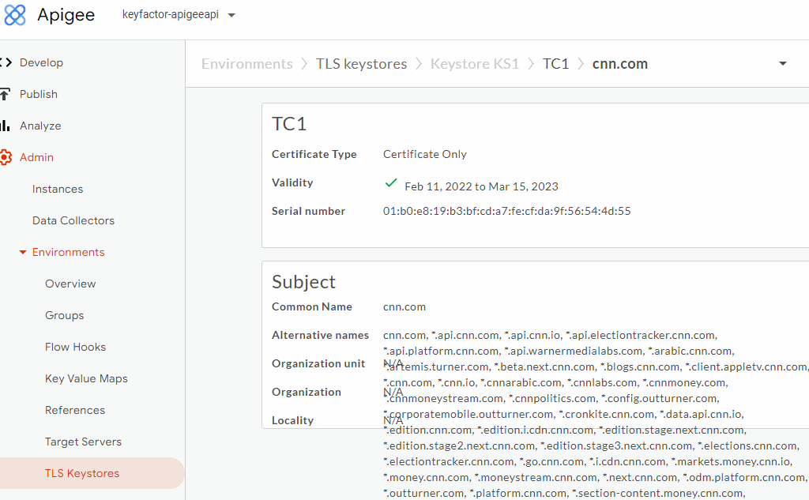
2|Add Additional Add Trust Store|This will test adding a new Alias to a Trust Store that has one Alias Already.|True|True|True|False|False|TC2|KS1|Alias/Certificate will be added.|True|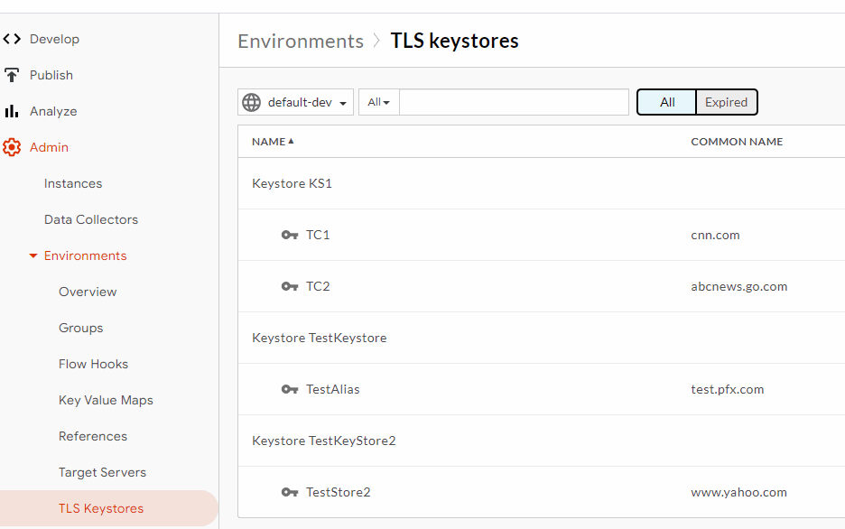
3|Replace Without Overwrite Trust Store|This will test the Overwrite Flag being false during a replace|False|True|True|True|False|TC1|KS1|Error will occur saying "Alias already Exists".|True|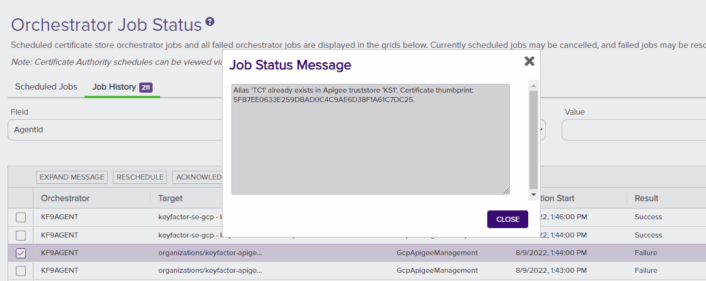
4|Replace With Overwrite Trust Store|This will test the Overwrite Flag being true during a replace|True|True|True|True|TC1|False|KS1|Error will occur saying "Renewals are not supported for Trust Stores.".|True|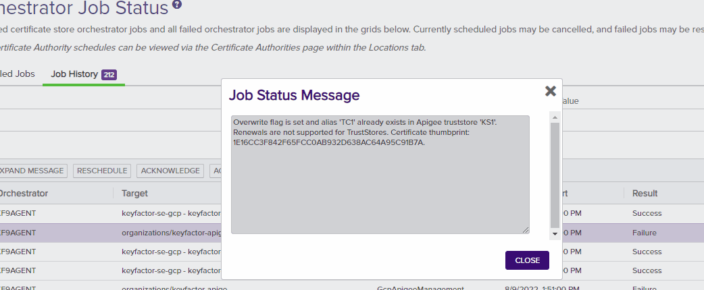
5|Remove From Trust Store |This will test removing an alias from a Trust Store|N/A|True|True|True|False|TC1|KS1|Alias/Certificate will be removed.|True|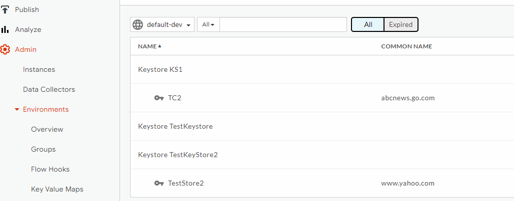
6|Trust Store Inventory |This will test the inventory of an item from the Trust Store|N/A|True|True|True|False|TC2|KS1|TC2 Alias/Certificate will be Inventoried.|True|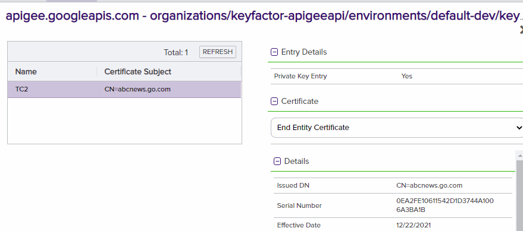
7|Fresh Add Keystore |This will test adding a new Alias to a Key Store that does not have any aliases.|True|True|True|False|True|TC7|KS2|TC7 Alias/Certificate will be added to KS2.|True|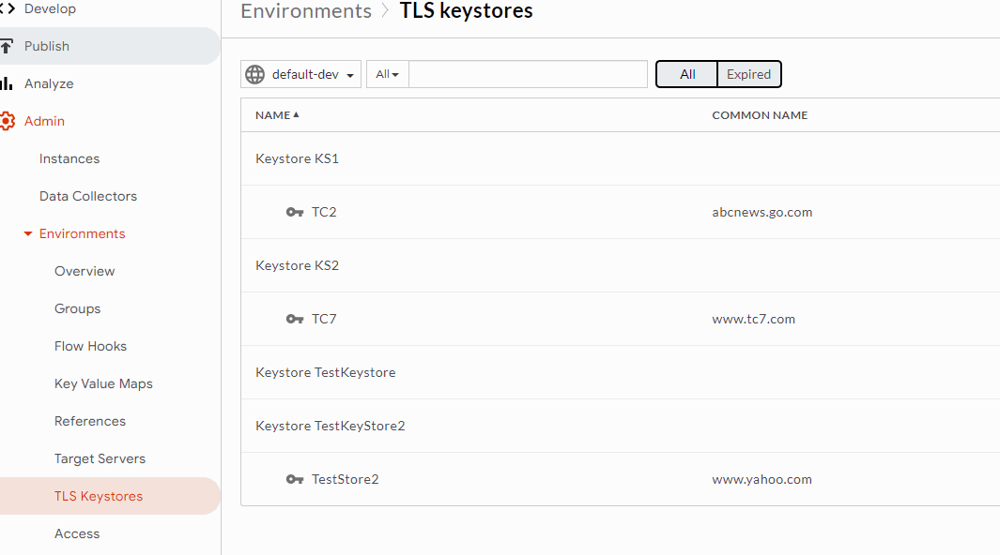
8|Add Additional Add Keystore, With Overwrite |This will test adding a new Alias to a Key Store that has one Alias Already.|True|False|True|True|True|TC8|KS2|Overwrite flag is set and 'TC8' does not exist in Apigee keystore 'KS2'. Cannot renew an alias if it doesn't exist.|True|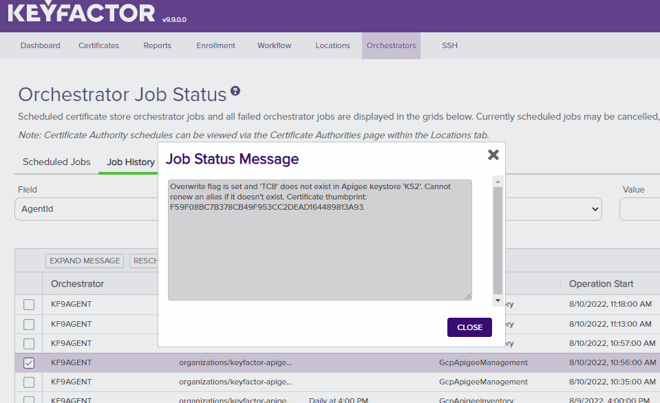
9|Add Additional Add Keystore, No Overwrite |This will test adding a new Alias to a Key Store that has one Alias Already.|False|False|True|True|True|TC9|KS2|Overwrite flag not set and 1 alias(es) already exist in Apigee keystore 'KS2'. Only 1 alias per keystore is supported for Add.|True|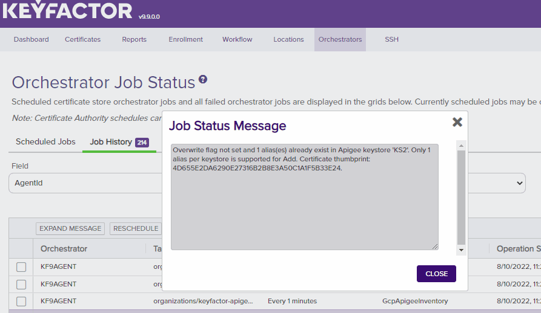
10|Replace/Renew In Keystore, With Overwrite |This will test replacing an Alias in a Key Store.|True|False|True|True|True|TC7|KS2|TC7 Will be replaced/renewed in KS2.|True|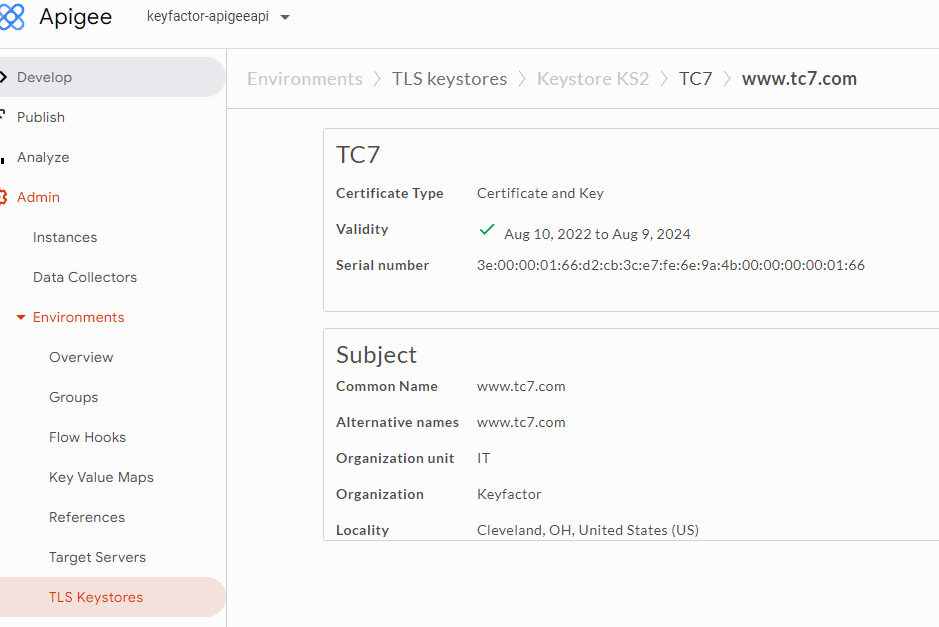
11|Replace/Renew In Keystore, No Overwrite |This will test replacing an Alias in a Key Store without the Overwrite Flag.|False|False|True|True|True|TC7|KS2|Overwrite flag not set and alias 'TC7' already exists in Apigee keystore 'KS2'. If attempting to renew, please check overwrite when scheduling this job.|True|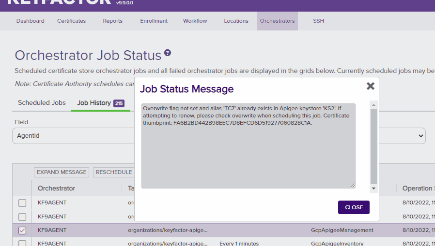
12|Key Store Inventory |This will test the inventory of an item from the Key Store|N/A|False|True|True|True|TC7|KS2|TC7 Alias/Certificate will be Inventoried.|True|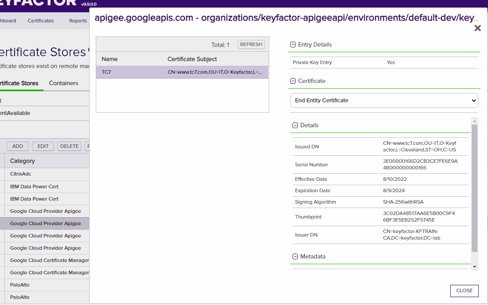
13|Remove From Keystore|This will test removing an alias from a Key Store|N/A|False|True|True|True|TC7|KS2|TC7 Alias/Certificate will be removed.|True|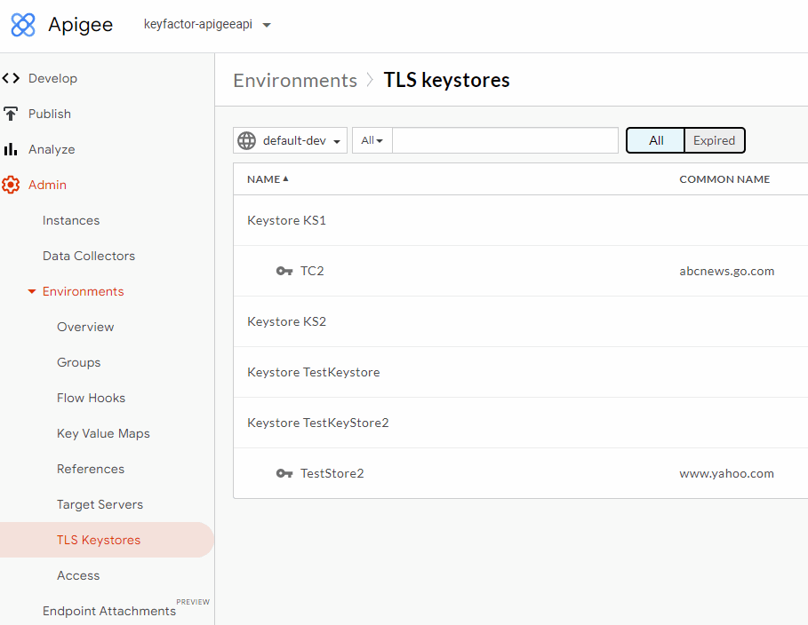
14|Certificate without Private Key to Key Store|This will test adding a certificate without a private key to a Keystore|False|False|True|False|False|TC14|KS2|Error Stating Alias 'TC14' does not contain a key and the Apigee store 'KS2' is a keystore. Can only add certs with their key|True|
15|Certificate with Private Key to Trust Store|This will test adding a certificate with a private key to a Trust Store|False|True|True|True|True|TC15|KS1|'TC15' contains a key and the Apigee store 'KS1' is a truststore. Can only add public certs to a truststore.|True|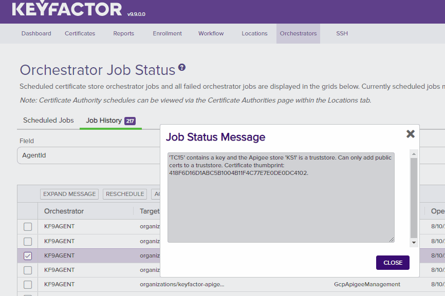
16|Add To Trust Store That Does Not Exist In Apigee|This will test adding a certificate without a private key to a Trust Store that does not exist in Apigee.|False|True|False|False|False|TC16|KS3|Unable to find keystore in Apigee|True|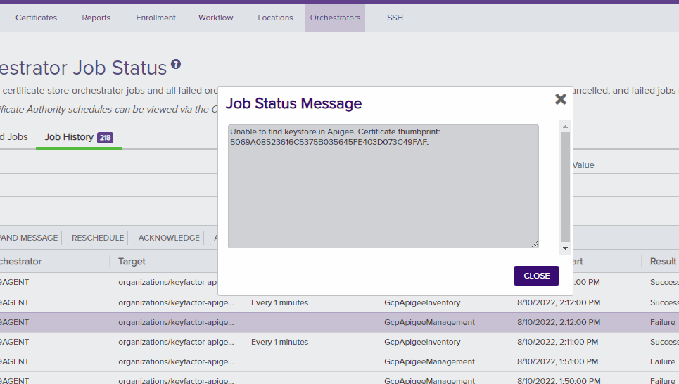
17|Add To Key Store That Does Not Exist In Apigee|This will test adding a certificate with a private key to a Key Store that does not exist in Apigee.|False|False|False|False|True|TC17|KS4|Unable to find keystore in Apigee|True|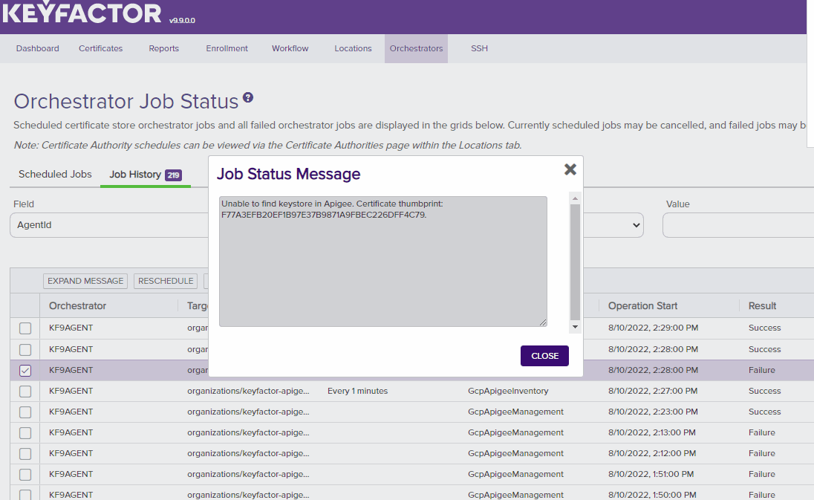
18|Create Trust Store|This will test creating a Trust Store in Apigee|N/A|True|False|N/A|N/A|TC18|KS3|Trust Store Gets Created In Apigee|True|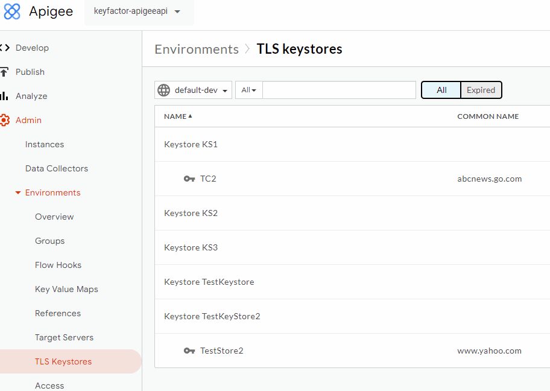
19|Create Key Store|This will test creating a Key Store in Apigee|N/A|False|False|N/A|N/A|TC17|KS5|Key Store is created in Apigee|True|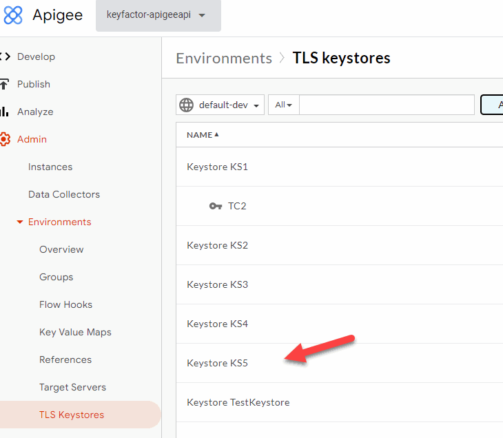


## License

Apache License 2.0, see [LICENSE](LICENSE).

## Related Integrations

See all [Keyfactor Universal Orchestrator extensions](https://github.com/orgs/Keyfactor/repositories?q=orchestrator).