**Remote GCP Apigee**

**Overview**

Apigee is a Google Cloud Platform (GCP) software product for developing and managing APIs.  The Remote GCP Apigee Orchestrator allows for the remote management of Apigee certificate stores.  Inventory and Management functions are supported.

This agent implements four job types – Inventory, Management Add, Create and Management Remove. Below are the steps necessary to configure this Orchestrator.

***
**Google Cloud Configuration**

1. Read up on Google Cloud Provider Apigee and how it works.

	*User must create a service account through the Google Cloud Console that will be used to generate an OAuth 2.0 token when making Apigee API requests 

		*Within the Google Cloud Console (console.cloud.google.com), select the project for which you will generate the OAuth 2.0 token
		
		*Click on the menu at the top-left and navigate to “APIs & Services”
		
		*Select “Credentials” from the sub-menu
		
		*Create a new Service Account by clicking the “Create Credentials” at the top of the screen and complete the following relevant to your environment:
			*Service Account Details
				*Service account name = Keyfactor-ApigeeAPI
					*This can be something to uniquely identify what this service account will be used for
				*Service account ID
				*Service account description
			*Grant this service account access to project
				*Select role: Quick Access > Basic > Owner
		*Click the “Done” button
		
	*Create service account key 

		*From the “APIs & Services” page, select the service account you just created in the previous step

		*Go to the “Keys” tab located across the top of the page 

		*Click the “Add Key” button in the middle of the page and select the “Create new key” option 

		*Make sure the key type selected is a JSON
			*(This is the key you will provide when configuring the cert store as outlined in the following instructions)
			
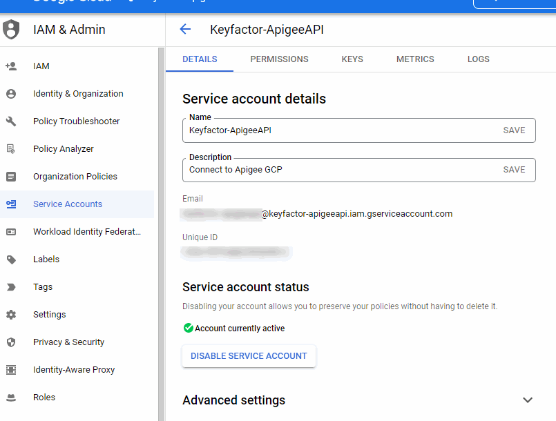
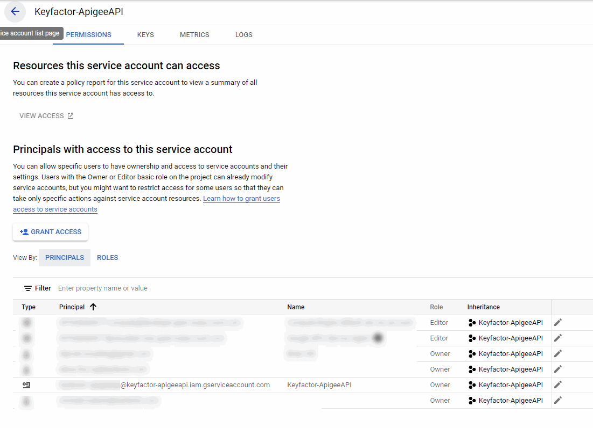
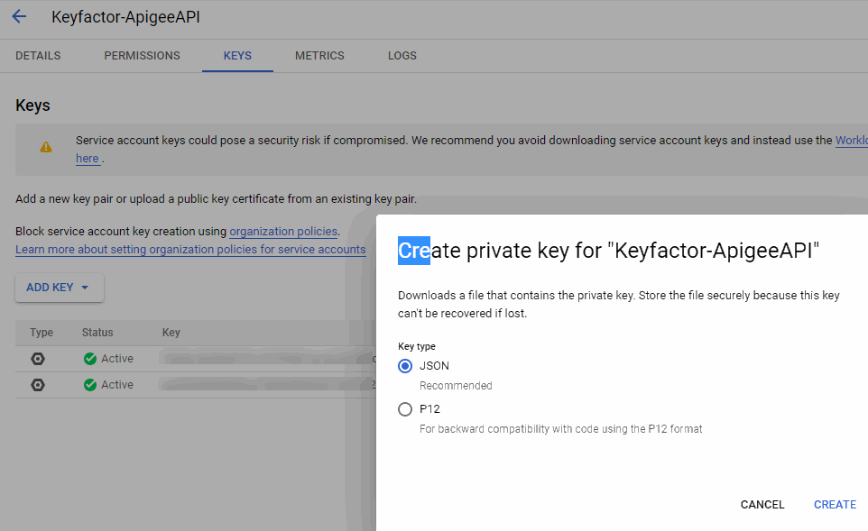
*** 
**1. Create the New Certificate Store Type for the GCP Apigee Orchestrator**

In Keyfactor Command create a new Certificate Store Type similar to the one below:

#### STORE TYPE CONFIGURATION
SETTING TAB  |  CONFIG ELEMENT	| DESCRIPTION
------|-----------|------------------
Basic |Name	|Descriptive name for the Store Type.  Google Cloud Provider Apigee can be used.
Basic |Short Name	|The short name that identifies the registered functionality of the orchestrator. Must be **GcpApigee**
Basic |Custom Capability|Unchecked
Basic |Supported Job Types	|Inventory, Add, Create and Remove are the supported job types. 
Basic |Needs Server	|Unchecked
Basic |Blueprint Allowed	|Checked
Basic |Requires Store Password	|Determines if a store password is required when configuring an individual store.  This must be unchecked.
Basic |Supports Entry Password	|Determines if an individual entry within a store can have a password.  This must be unchecked.
Advanced |Store Path Type| Determines how the user will enter the store path when setting up the cert store.  Freeform
Advanced |Supports Custom Alias	|Determines if an individual entry within a store can have a custom Alias.  This must be Required
Advanced |Private Key Handling |Determines how the orchestrator deals with private keys.  Optional
Advanced |PFX Password Style |Determines password style for the PFX Password. Default
Custom Fields|Is Trust Store?|Name: **isTrustStore** Display Name: **Is Trust Store?** Type: **Boolean** Default Value: **False** Required: **True**
Custom Fields|Google Json Key File|Name: **jsonKey** Display Name: **Google Json Key File** Type: **Secret** Default Value: **N/A** Required: **True**
Entry Parameters|N/A| There are no Entry Parameters

**Basic Settings:**

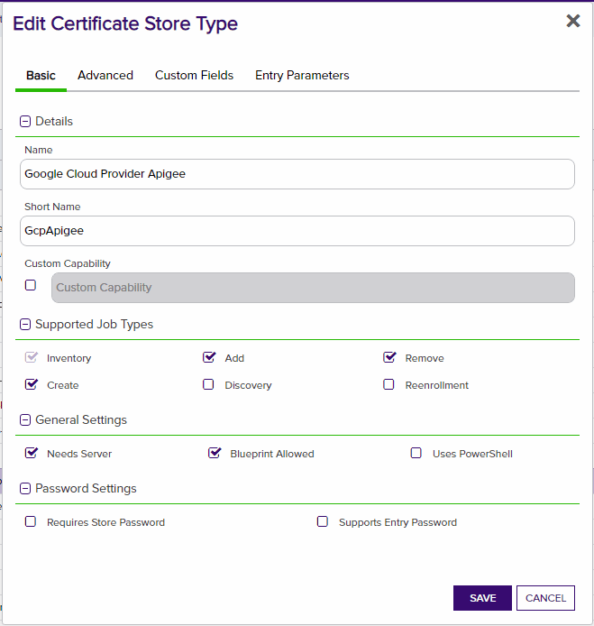

**Advanced Settings:**

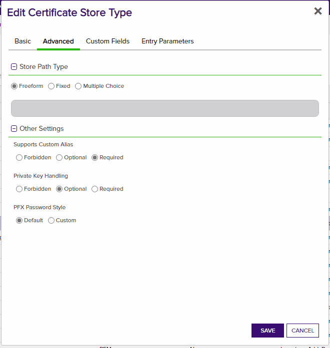

**Custom Fields:**

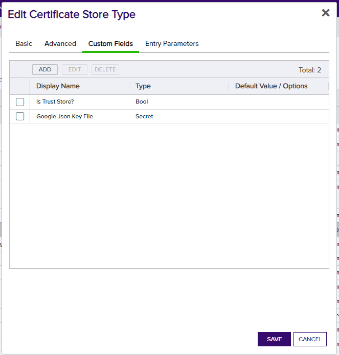
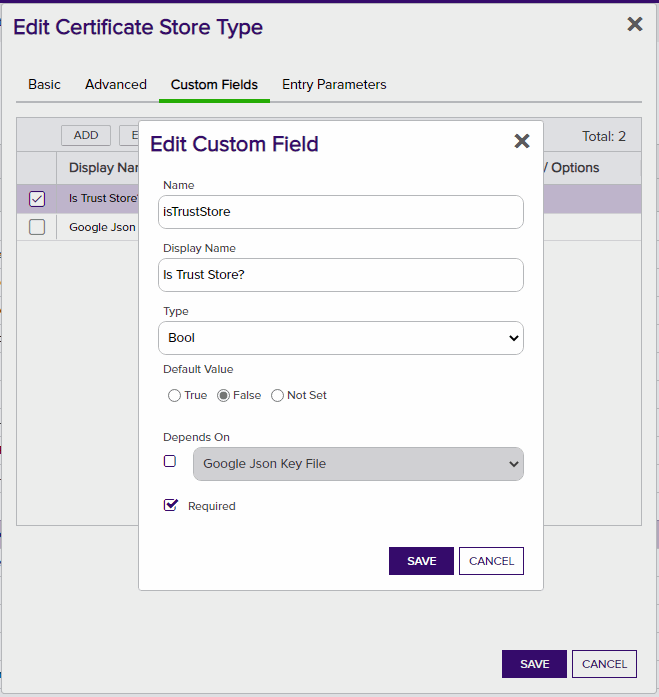
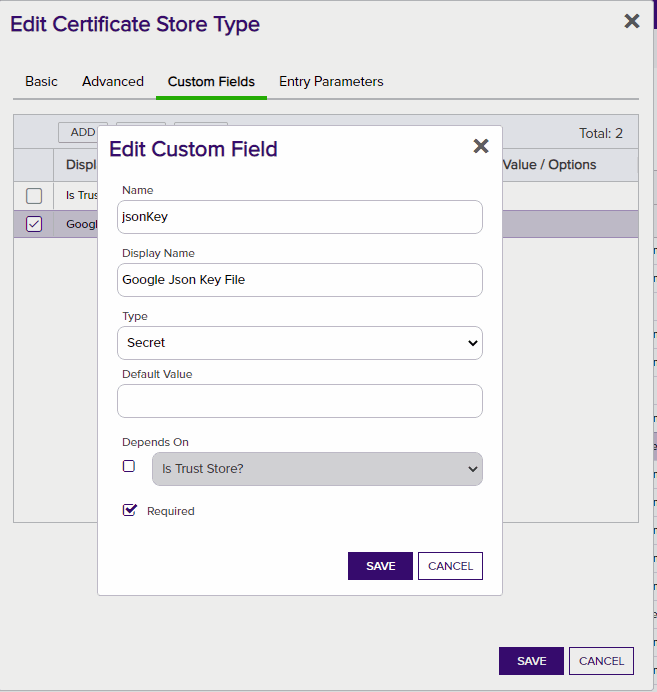

**Entry Params:**

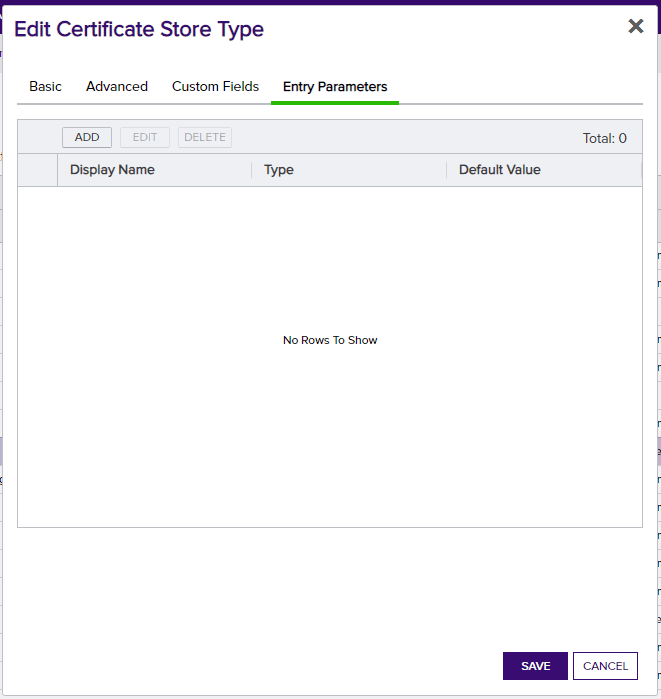

**2. Register the GCP Apigee Orchestrator with Keyfactor**
See Keyfactor "InstallingKeyfactorOrchestrators.pdf" Documentation.  Get from your Keyfactor contact/representative.

**3. Create a GCP Apigee Certificate Store within Keyfactor Command**
In Keyfactor Command create a new Certificate Store similar to the one below

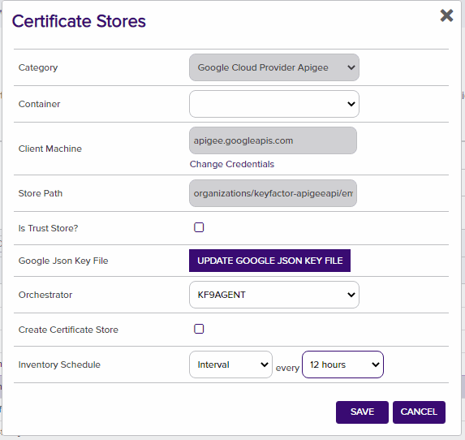

#### STORE CONFIGURATION 
CONFIG ELEMENT	|DESCRIPTION
----------------|---------------
Category	|The type of certificate store to be configured. Select category based on the display name configured above "Google Cloud Provider Apigee".
Container	|This is a logical grouping of like stores. This configuration is optional and does not impact the functionality of the store.
Client Machine	|The Base URL for the GCP Apigee REST Api. Should be **apigee.googleapis.com**
Store Path	|This will point to the Apigee keystore that you are managing, and must be provided in the following format, where {org}, {env}, and {keystore} will be replaced with your environment-specific values organizations/{org}/environments/{env}/keystores/{keystore} 
Google Json Key File|Will need updated with the JSON key tied to the Apigee service account. You can copy and paste the entire key Json in the textboxes.
Is Trust Store?|Should be checked if the Apigee keystore being managed is a truststore.
Orchestrator	|This is the orchestrator server registered with the appropriate capabilities to manage this certificate store type. 
Inventory Schedule	|The interval that the system will use to report on what certificates are currently in the store. 
Use SSL	|This should be checked.
User	|This is not necessary.
Password |This is not necessary.

*** 

#### Usage

#### TEST CASES
Case Number|Case Name|Case Description|Overwrite Flag?|Trust Store?|Keystore Exists?|Existing Alias?|Private Key?|Alias Name|KeyStore Name|Expected Results|Passed|Screenshots
------------|---------|----------------|--------------|----------|----------------|--------------|---------------|--------------|------------|-----------|------------|-----------
1|Fresh Add Trust Store|This will test adding a new Alias to a Trust Store that does not have any aliases.|True|True|True|False|False|TC1|KS1|Alias/Certificate will be added.|True|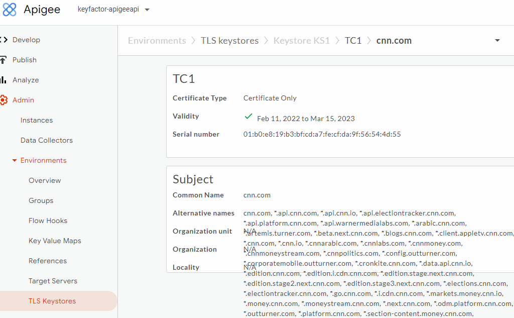
2|Add Additional Add Trust Store|This will test adding a new Alias to a Trust Store that has one Alias Already.|True|True|True|False|False|TC2|KS1|Alias/Certificate will be added.|True|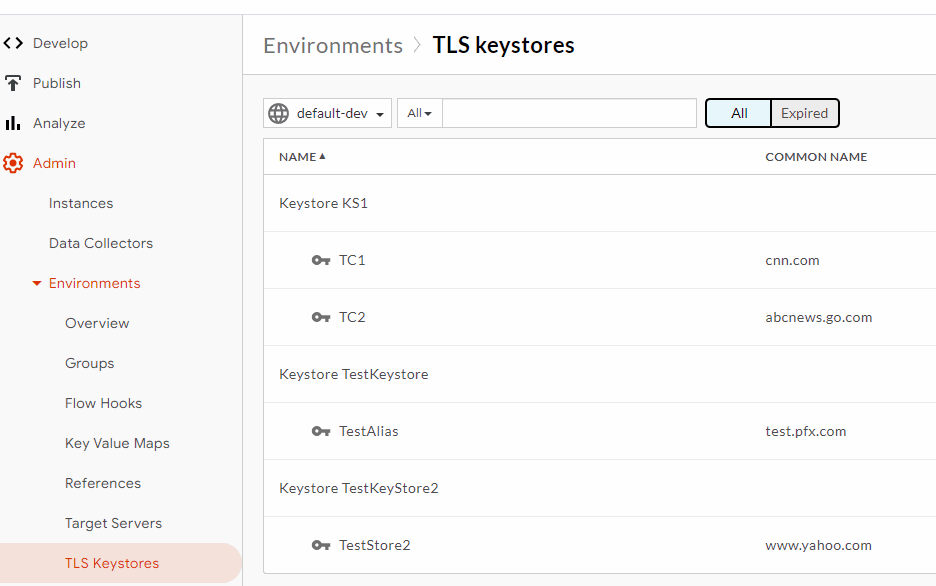
3|Replace Without Overwrite Trust Store|This will test the Overwrite Flag being false during a replace|False|True|True|True|False|TC1|KS1|Error will occur saying "Alias already Exists".|True|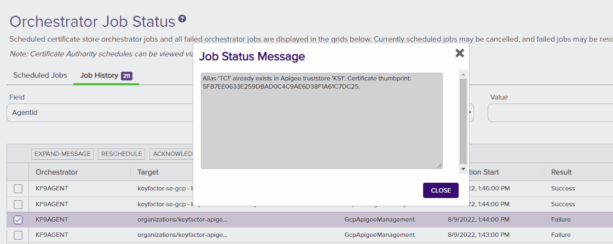
4|Replace With Overwrite Trust Store|This will test the Overwrite Flag being true during a replace|True|True|True|True|TC1|False|KS1|Error will occur saying "Renewals are not supported for Trust Stores.".|True|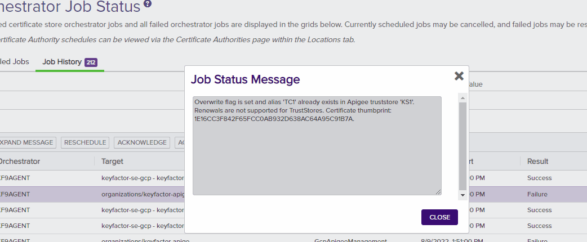
5|Remove From Trust Store |This will test removing an alias from a Trust Store|N/A|True|True|True|False|TC1|KS1|Alias/Certificate will be removed.|True|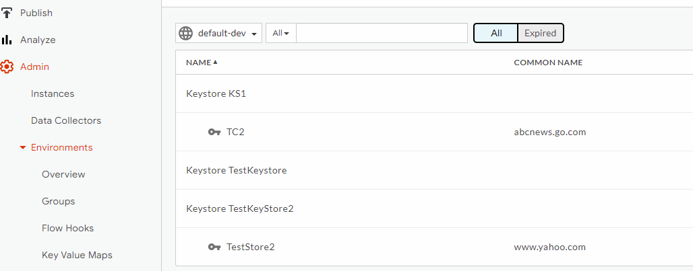
6|Trust Store Inventory |This will test the inventory of an item from the Trust Store|N/A|True|True|True|False|TC2|KS1|TC2 Alias/Certificate will be Inventoried.|True|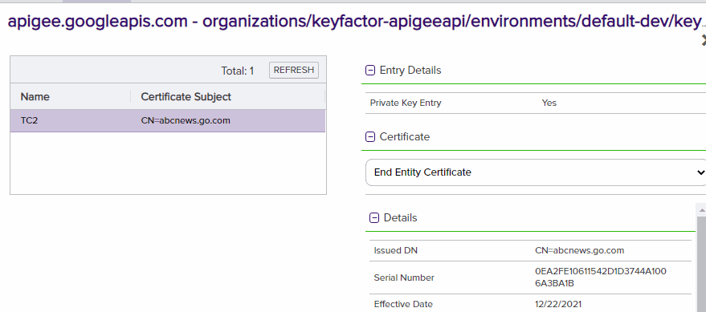
7|Fresh Add Keystore |This will test adding a new Alias to a Key Store that does not have any aliases.|True|True|True|False|True|TC7|KS2|TC7 Alias/Certificate will be added to KS2.|True|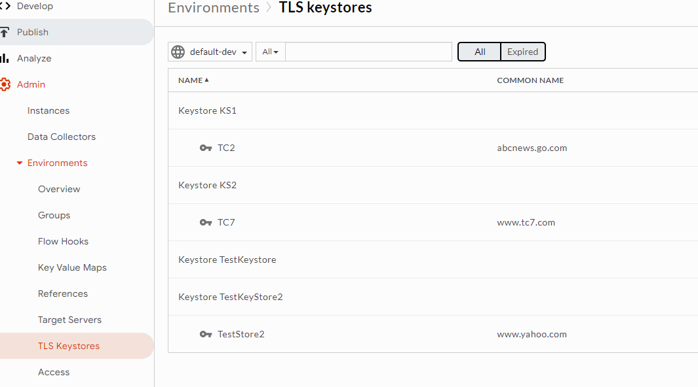
8|Add Additional Add Keystore, With Overwrite |This will test adding a new Alias to a Key Store that has one Alias Already.|True|False|True|True|True|TC8|KS2|Overwrite flag is set and 'TC8' does not exist in Apigee keystore 'KS2'. Cannot renew an alias if it doesn't exist.|True|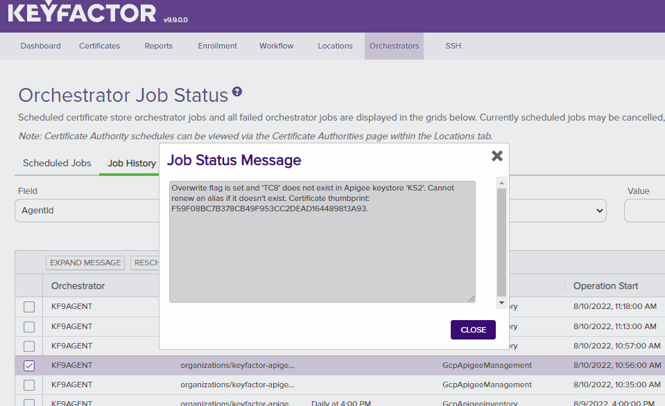
9|Add Additional Add Keystore, No Overwrite |This will test adding a new Alias to a Key Store that has one Alias Already.|False|False|True|True|True|TC9|KS2|Overwrite flag not set and 1 alias(es) already exist in Apigee keystore 'KS2'. Only 1 alias per keystore is supported for Add.|True|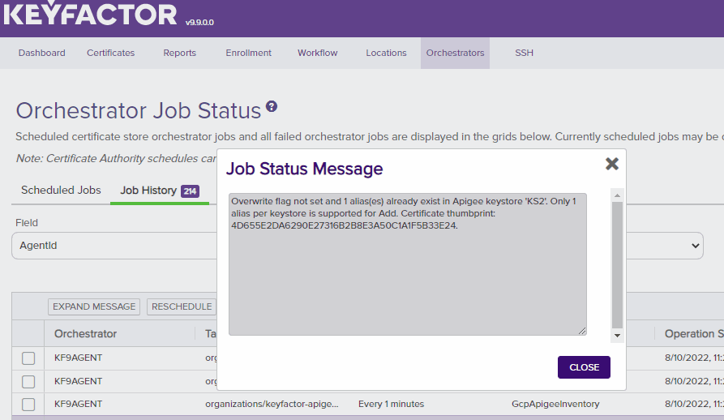
10|Replace/Renew In Keystore, With Overwrite |This will test replacing an Alias in a Key Store.|True|False|True|True|True|TC7|KS2|TC7 Will be replaced/renewed in KS2.|True|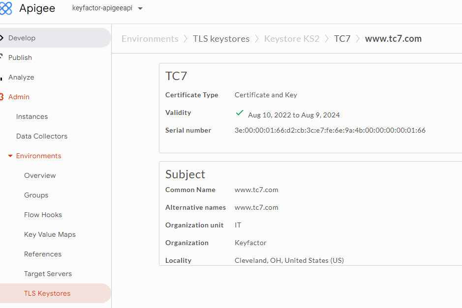
11|Replace/Renew In Keystore, No Overwrite |This will test replacing an Alias in a Key Store without the Overwrite Flag.|False|False|True|True|True|TC7|KS2|Overwrite flag not set and alias 'TC7' already exists in Apigee keystore 'KS2'. If attempting to renew, please check overwrite when scheduling this job.|True|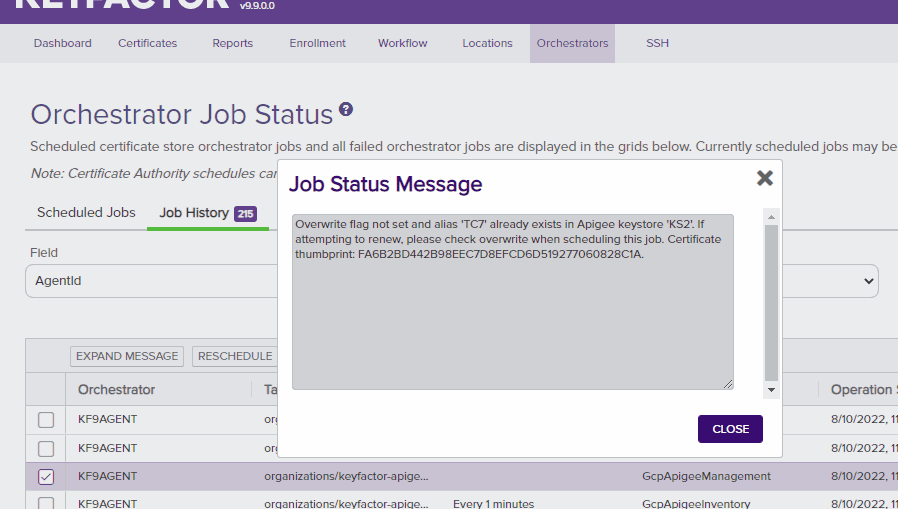
12|Key Store Inventory |This will test the inventory of an item from the Key Store|N/A|False|True|True|True|TC7|KS2|TC7 Alias/Certificate will be Inventoried.|True|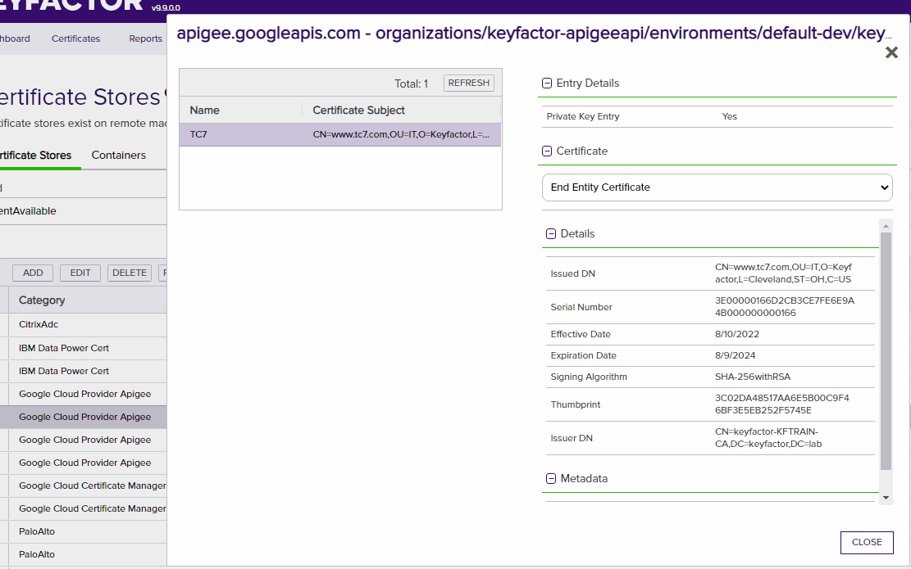
13|Remove From Keystore|This will test removing an alias from a Key Store|N/A|False|True|True|True|TC7|KS2|TC7 Alias/Certificate will be removed.|True|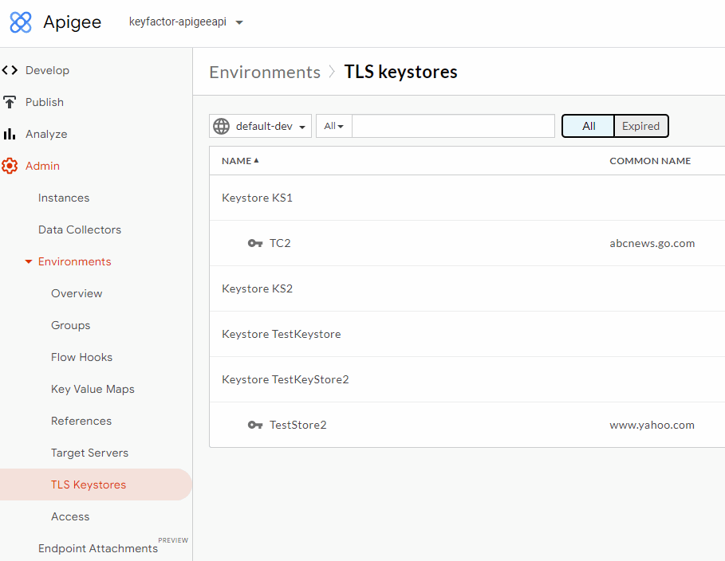
14|Certificate without Private Key to Key Store|This will test adding a certificate without a private key to a Keystore|False|False|True|False|False|TC14|KS2|Error Stating Alias 'TC14' does not contain a key and the Apigee store 'KS2' is a keystore. Can only add certs with their key|True|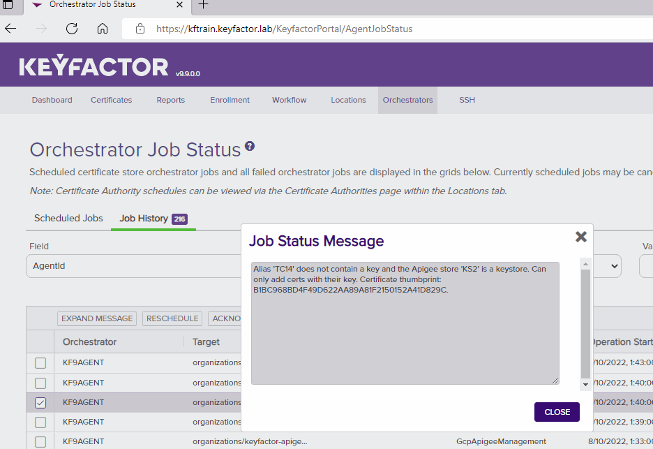
15|Certificate with Private Key to Trust Store|This will test adding a certificate with a private key to a Trust Store|False|True|True|True|True|TC15|KS1|'TC15' contains a key and the Apigee store 'KS1' is a truststore. Can only add public certs to a truststore.|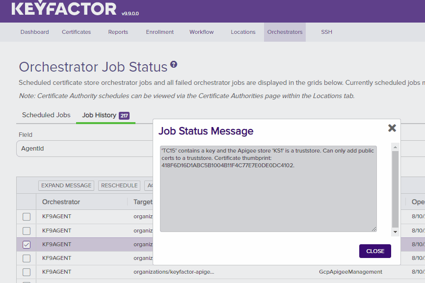
16|Add To Trust Store That Does Not Exist In Apigee|This will test adding a certificate without a private key to a Trust Store that does not exist in Apigee.|False|True|False|False|False|TC16|KS3|Unable to find keystore in Apigee|True|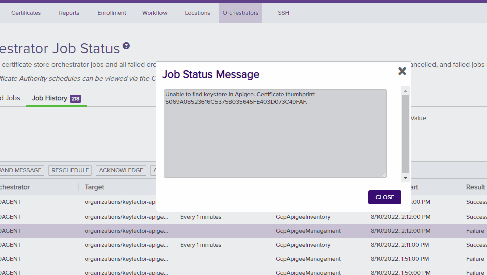
17|Add To Key Store That Does Not Exist In Apigee|This will test adding a certificate with a private key to a Key Store that does not exist in Apigee.|False|False|False|False|True|TC17|KS4|Unable to find keystore in Apigee|True|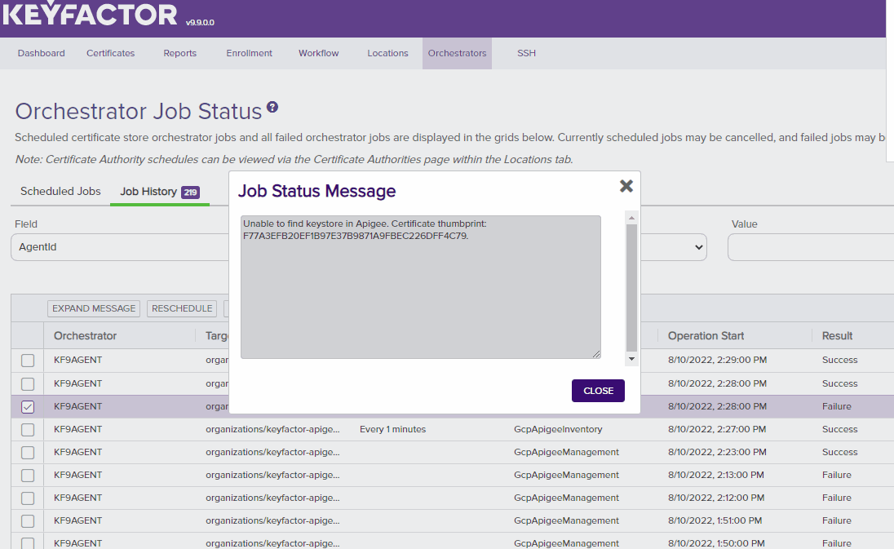
18|Create Trust Store|This will test creating a Trust Store in Apigee|N/A|True|False|N/A|N/A|TC18|KS3|Trust Store Gets Created In Apigee|True|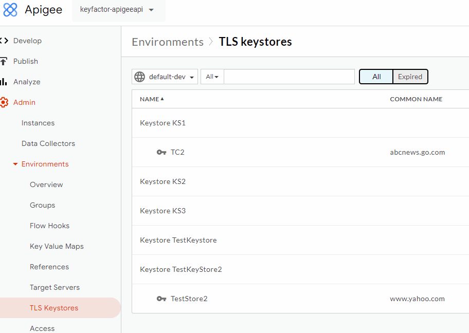
19|Create Key Store|This will test creating a Key Store in Apigee|N/A|False|False|N/A|N/A|TC17|KS5|Key Store is created in Apigee|True|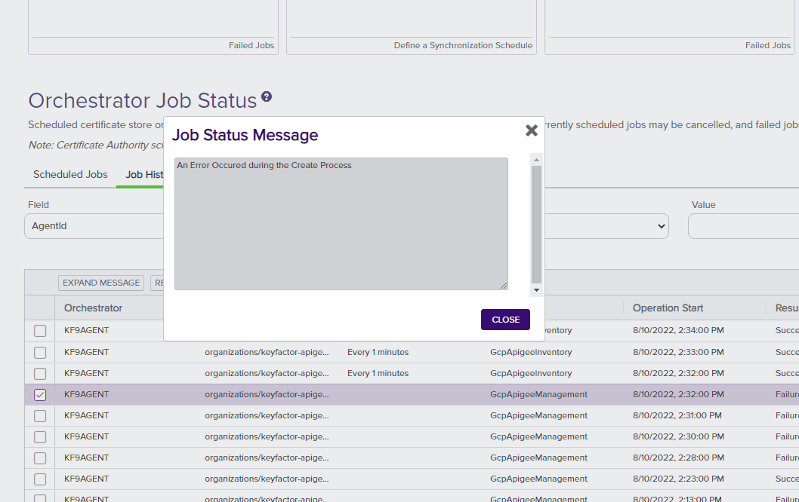

